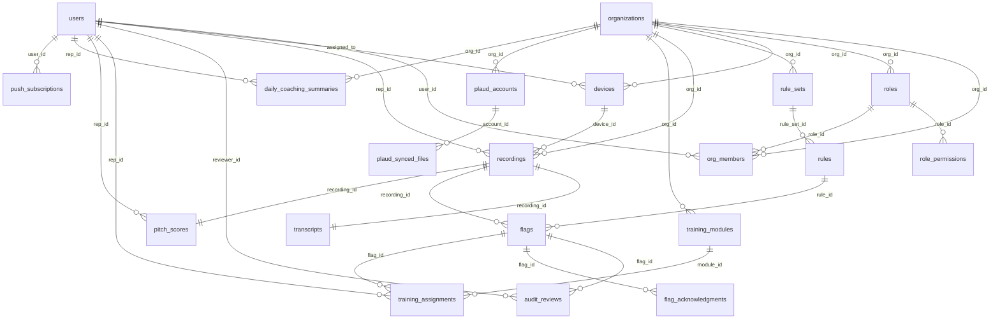

# Knocksafe — Data Model (ER)

## Context

Built from both prototypes and business requirements. The Vercel prototype already has the core flow working (single-tenant): reps, phrases, transcripts, flags, Plaud OAuth. What is missing: multi-tenancy, roles, complete audit workflow, training, and better rule structure.

---

## Full ER Diagram

---

## Audit Fields (standard across all tables)

All domain tables include these 6 fields. They are listed explicitly in each table below:

| Column | Type | Notes |
|--------|------|-------|
| `created_at` | TIMESTAMPTZ DEFAULT now() | When the record was created |
| `created_by` | UUID FK → users NULL | Who created it (NULL = system/cron) |
| `updated_at` | TIMESTAMPTZ DEFAULT now() | Last modification |
| `updated_by` | UUID FK → users NULL | Who modified it |
| `deleted_at` | TIMESTAMPTZ NULL | Soft delete — NULL = active |
| `deleted_by` | UUID FK → users NULL | Who deleted it |

**Conventions:**
- Soft delete on all tables: `WHERE deleted_at IS NULL` in queries by default
- `created_by` / `updated_by` / `deleted_by` are NULL when the action is performed by the system (crons, webhooks, AI)
- Operational tables (`plaud_synced_files`, `cron_heartbeat`) may omit `deleted_at`/`deleted_by` if soft delete does not apply

**Tables that include all fields:** `organizations`, `users`, `org_members`, `devices`, `plaud_accounts`, `recordings`, `transcripts`, `rule_sets`, `rules`, `flags`, `flag_acknowledgments`, `audit_reviews`, `training_modules`, `training_assignments`

---

## Entities and Attributes

### 1. `organizations` — Tenants

The central node of multi-tenancy. Each client company is an organization.

| Column | Type | Notes |
|--------|------|-------|
| `id` | UUID PK | |
| `name` | VARCHAR(255) | Client company name |
| `slug` | VARCHAR(100) UNIQUE | Short identifier for URLs and subdomains |
| `status` | ENUM | `trial`, `active`, `suspended` |
| `settings` | JSONB | Per-tenant config (timezone, language, notifications) |
| `created_at` | TIMESTAMPTZ DEFAULT now() | When the record was created |
| `created_by` | UUID FK → users NULL | Who created it (NULL = system) |
| `updated_at` | TIMESTAMPTZ DEFAULT now() | Last modification |
| `updated_by` | UUID FK → users NULL | Who modified it |
| `deleted_at` | TIMESTAMPTZ NULL | Soft delete — NULL = active |
| `deleted_by` | UUID FK → users NULL | Who deleted it |

---

### 2. `users` — All people

Unified table. A user can belong to multiple orgs via `org_members`.

| Column | Type | Notes |
|--------|------|-------|
| `id` | UUID PK | |
| `email` | VARCHAR(255) UNIQUE | Globally unique login |
| `password_hash` | VARCHAR(255) NULL | NULL if using SSO |
| `first_name` | VARCHAR(100) | |
| `last_name` | VARCHAR(100) | |
| `phone` | VARCHAR(50) NULL | |
| `avatar_url` | TEXT NULL | |
| `status` | ENUM | `active`, `inactive`, `suspended` |
| `last_login_at` | TIMESTAMPTZ NULL | |
| `created_at` | TIMESTAMPTZ DEFAULT now() | When the record was created |
| `created_by` | UUID FK → users NULL | Who created it (NULL = system) |
| `updated_at` | TIMESTAMPTZ DEFAULT now() | Last modification |
| `updated_by` | UUID FK → users NULL | Who modified it |
| `deleted_at` | TIMESTAMPTZ NULL | Soft delete — NULL = active |
| `deleted_by` | UUID FK → users NULL | Who deleted it |

**Discussion point:** Email is globally UNIQUE. A user with the same email in two orgs is the same user with two memberships. Alternative: UNIQUE(email, org) to allow repeated emails across orgs — but complicates login.

---

### 3. `roles` — Role definitions

Catalog of available roles. Can be global (platform-wide) or organization-specific, allowing each org to define custom roles if needed. The system ships with predefined roles (seed): `platform_admin`, `org_admin`, `manager`, `auditor`, `rep`.

| Column | Type | Notes |
|--------|------|-------|
| `id` | UUID PK | |
| `org_id` | UUID FK → organizations NULL | NULL = global platform role |
| `name` | VARCHAR(50) | Unique role identifier, e.g.: `org_admin`, `auditor` |
| `display_name` | VARCHAR(100) | Human-readable name, e.g.: "Organization Administrator" |
| `description` | TEXT NULL | What this role can do |
| `is_system` | BOOLEAN DEFAULT false | true = predefined role, cannot be deleted |
| `created_at` | TIMESTAMPTZ DEFAULT now() | When the record was created |
| `created_by` | UUID FK → users NULL | Who created it (NULL = system) |
| `updated_at` | TIMESTAMPTZ DEFAULT now() | Last modification |
| `updated_by` | UUID FK → users NULL | Who modified it |
| `deleted_at` | TIMESTAMPTZ NULL | Soft delete — NULL = active |
| `deleted_by` | UUID FK → users NULL | Who deleted it |

UNIQUE(`org_id`, `name`) — a role name cannot repeat within the same org (or at global level if org_id is NULL)

**Predefined roles (seed):**
- `platform_admin` — platform staff, sees everything, manages organizations
- `org_admin` — client company admin, manages their entire org
- `manager` — rep supervisor, views team metrics, assigns training
- `auditor` — reviews flags, approves/dismisses violations
- `rep` — salesperson, views own history and assigned tasks

---

### 4. `role_permissions` — Permissions per role

Defines what each role can do at a granular level. Each permission is a string in `resource:action` format, e.g.: `flags:review`, `rules:create`, `recordings:view_all`. Allows adjusting permissions without touching code.

| Column | Type | Notes |
|--------|------|-------|
| `id` | UUID PK | |
| `role_id` | UUID FK → roles | |
| `permission` | VARCHAR(100) | Format `resource:action`, e.g.: `flags:review` |
| `created_at` | TIMESTAMPTZ DEFAULT now() | When the record was created |
| `created_by` | UUID FK → users NULL | Who created it (NULL = system) |

UNIQUE(`role_id`, `permission`)

**Suggested initial permissions:**

| Permission | platform_admin | org_admin | manager | auditor | rep |
|------------|:-:|:-:|:-:|:-:|:-:|
| `orgs:manage` | x | | | | |
| `users:manage` | x | x | | | |
| `users:view_team` | x | x | x | | |
| `roles:manage` | x | x | | | |
| `devices:manage` | x | x | | | |
| `rules:manage` | x | x | | | |
| `recordings:view_all` | x | x | x | | |
| `recordings:view_own` | x | x | x | x | x |
| `flags:view_all` | x | x | x | x | |
| `flags:view_own` | x | x | x | x | x |
| `flags:review` | x | x | x | x | |
| `training:manage` | x | x | x | | |
| `training:view_own` | x | x | x | x | x |
| `reports:view` | x | x | x | | |
| `pitchbot:view_all` | x | x | x | | |
| `pitchbot:view_own` | x | x | x | x | x |

---

### 5. `org_members` — User membership in organizations

Links users to organizations with a role. A user can have multiple roles in one org, or belong to multiple orgs.

| Column | Type | Notes |
|--------|------|-------|
| `id` | UUID PK | |
| `user_id` | UUID FK → users | |
| `org_id` | UUID FK → organizations | |
| `role_id` | UUID FK → roles | Role assigned in this org |
| `joined_at` | TIMESTAMPTZ | When they joined the org |
| `created_at` | TIMESTAMPTZ DEFAULT now() | When the record was created |
| `created_by` | UUID FK → users NULL | Who created it (NULL = system) |
| `updated_at` | TIMESTAMPTZ DEFAULT now() | Last modification |
| `updated_by` | UUID FK → users NULL | Who modified it |
| `deleted_at` | TIMESTAMPTZ NULL | Soft delete — NULL = active |
| `deleted_by` | UUID FK → users NULL | Who deleted it |

UNIQUE(`user_id`, `org_id`, `role_id`)

---

### 6. `devices` — Plaud Devices

Inventory of physical Plaud devices that reps carry during their visits. Each device belongs to an organization and can be assigned to a specific rep. When a rep changes devices or leaves the company, the device is reassigned without losing the history of previous recordings linked to that serial number.

| Column | Type | Notes |
|--------|------|-------|
| `id` | UUID PK | |
| `org_id` | UUID FK → organizations | |
| `assigned_to` | UUID FK → users NULL | Assigned rep |
| `serial_number` | VARCHAR(100) UNIQUE | Physical Plaud serial |
| `nickname` | VARCHAR(100) NULL | Friendly device name |
| `device_type` | VARCHAR(50) | `plaud_notepin`, etc. |
| `status` | ENUM | `active`, `unassigned`, `decommissioned` |
| `last_seen_at` | TIMESTAMPTZ NULL | Last sync |
| `created_at` | TIMESTAMPTZ DEFAULT now() | When the record was created |
| `created_by` | UUID FK → users NULL | Who created it (NULL = system) |
| `updated_at` | TIMESTAMPTZ DEFAULT now() | Last modification |
| `updated_by` | UUID FK → users NULL | Who modified it |
| `deleted_at` | TIMESTAMPTZ NULL | Soft delete — NULL = active |
| `deleted_by` | UUID FK → users NULL | Who deleted it |

---

### 7. `plaud_accounts` — OAuth Credentials with the Plaud API

To automatically sync recordings, Knocksafe needs to connect to the Plaud API. Each rep (or the entire org) authorizes access via OAuth, and the resulting tokens are stored here. A cron job every 15 minutes uses these tokens to check for new files in Plaud, refresh expired tokens, and download transcriptions/audio. If `rep_id` is NULL, the account is at the organization level (an admin connected it and it covers all reps in that org).

| Column | Type | Notes |
|--------|------|-------|
| `id` | UUID PK | |
| `org_id` | UUID FK → organizations | |
| `rep_id` | UUID FK → users NULL | NULL = org-level account |
| `plaud_user_id` | VARCHAR(100) NULL | ID in Plaud |
| `label` | VARCHAR(100) | Descriptive account name |
| `access_token` | TEXT | Encrypted |
| `refresh_token` | TEXT | Encrypted |
| `token_expires_at` | TIMESTAMPTZ | |
| `last_synced_at` | TIMESTAMPTZ NULL | |
| `created_at` | TIMESTAMPTZ DEFAULT now() | When the record was created |
| `created_by` | UUID FK → users NULL | Who created it (NULL = system) |
| `updated_at` | TIMESTAMPTZ DEFAULT now() | Last modification |
| `updated_by` | UUID FK → users NULL | Who modified it |
| `deleted_at` | TIMESTAMPTZ NULL | Soft delete — NULL = active |
| `deleted_by` | UUID FK → users NULL | Who deleted it |

---

### 8. `plaud_synced_files` — Record of already-processed files

Every time the cron syncs with Plaud, it gets a list of files (recordings). This table records which files have already been downloaded and processed to avoid duplicates. Without this table, each cron execution would re-process all recordings. This is an operational table — it has no soft delete because records are never "deleted", only queried to check "have I already processed this file?"

| Column | Type | Notes |
|--------|------|-------|
| `id` | UUID PK | |
| `plaud_account_id` | UUID FK → plaud_accounts | Which OAuth account it was downloaded from |
| `plaud_file_id` | VARCHAR(100) UNIQUE | File ID in the Plaud API |
| `rep_id` | UUID FK → users NULL | Rep the recording belongs to |
| `synced_at` | TIMESTAMPTZ | When it was processed |

---

### 9. `recordings` — Each recorded conversation

Represents a real interaction between a rep and a customer at the door. Contains event metadata (when it happened, duration, location) and the audio reference. Each recording goes through a pipeline: arrives as `pending`, gets transcribed (`transcribing`), gets analyzed by AI (`analyzing`), and ends as `completed` or `error`. The `source` indicates how it arrived: automatic Plaud sync, webhook, mobile app upload, or manual upload.

| Column | Type | Notes |
|--------|------|-------|
| `id` | UUID PK | |
| `org_id` | UUID FK → organizations | |
| `rep_id` | UUID FK → users | |
| `device_id` | UUID FK → devices NULL | |
| `plaud_file_id` | VARCHAR(100) NULL | Plaud reference |
| `recorded_at` | TIMESTAMPTZ | When the conversation happened |
| `duration_seconds` | INTEGER NULL | |
| `audio_url` | TEXT NULL | URL to audio (S3 or presigned) |
| `status` | ENUM | `pending`, `transcribing`, `analyzing`, `completed`, `error` |
| `source` | ENUM | `plaud_sync`, `plaud_webhook`, `mobile_upload`, `manual` |
| `summary` | TEXT NULL | AI summary of the conversation |
| `location` | JSONB NULL | `{lat, lng, address}` |
| `metadata` | JSONB | Any extra data |
| `created_at` | TIMESTAMPTZ DEFAULT now() | When it entered the system |
| `created_by` | UUID FK → users NULL | Who created it (NULL = system/cron) |
| `updated_at` | TIMESTAMPTZ DEFAULT now() | Last modification |
| `updated_by` | UUID FK → users NULL | Who modified it |
| `deleted_at` | TIMESTAMPTZ NULL | Soft delete — NULL = active |
| `deleted_by` | UUID FK → users NULL | Who deleted it |

---

### 10. `transcripts` — Transcription text

Separated from `recordings` to allow re-transcribing with a different provider without losing the original recording. Contains the full text and optionally segments with timestamps (useful for knowing at which second of the audio each phrase was spoken). 1:1 relationship with recordings.

| Column | Type | Notes |
|--------|------|-------|
| `id` | UUID PK | |
| `recording_id` | UUID FK → recordings UNIQUE | 1:1 |
| `full_text` | TEXT | Full transcription |
| `segments` | JSONB NULL | `[{start, end, speaker, text}]` |
| `language` | VARCHAR(10) | `en`, `es` |
| `confidence` | DECIMAL(4,3) NULL | Transcription provider confidence |
| `word_count` | INTEGER NULL | For stats |
| `provider` | VARCHAR(50) | `plaud`, `whisper`, `deepgram` |
| `created_at` | TIMESTAMPTZ DEFAULT now() | When the record was created |
| `created_by` | UUID FK → users NULL | Who created it (NULL = system) |
| `updated_at` | TIMESTAMPTZ DEFAULT now() | Last modification |
| `updated_by` | UUID FK → users NULL | Who modified it |
| `deleted_at` | TIMESTAMPTZ NULL | Soft delete — NULL = active |
| `deleted_by` | UUID FK → users NULL | Who deleted it |

---

### 11. `rule_sets` — Compliance rule sets per org

Allows each organization to group their rules into thematic sets. For example, an org could have a set called "Prohibited Terms" (inappropriate or vulgar words) and another called "Professional Language" (misleading phrases or unauthorized promises). Entire sets can be activated/deactivated. An org admin creates and manages these sets.

| Column | Type | Notes |
|--------|------|-------|
| `id` | UUID PK | |
| `org_id` | UUID FK → organizations | |
| `name` | VARCHAR(255) | Set name, e.g.: "Prohibited Terms", "Sales Ethics" |
| `description` | TEXT NULL | |
| `is_active` | BOOLEAN | |
| `created_at` | TIMESTAMPTZ DEFAULT now() | When the record was created |
| `created_by` | UUID FK → users NULL | Who created it |
| `updated_at` | TIMESTAMPTZ DEFAULT now() | Last modification |
| `updated_by` | UUID FK → users NULL | Who modified it |
| `deleted_at` | TIMESTAMPTZ NULL | Soft delete — NULL = active |
| `deleted_by` | UUID FK → users NULL | Who deleted it |

---

### 12. `rules` — Individual banned words/phrases

Each rule defines exactly what to look for in a transcript. Each rule includes: match type (keyword, phrase, regex, or semantic via AI), severity, category, and matching options. Example: a rule with `match_type=keyword`, `match_value="naked"`, `severity=critical`, `category=profanity` would search for that inappropriate word in each transcript and raise a critical severity flag.

| Column | Type | Notes |
|--------|------|-------|
| `id` | UUID PK | |
| `rule_set_id` | UUID FK → rule_sets | |
| `category` | ENUM | `profanity`, `competitor`, `misleading`, `prohibited_term`, `custom` |
| `severity` | ENUM | `low`, `medium`, `high`, `critical` |
| `match_type` | ENUM | `keyword`, `phrase`, `regex`, `semantic` |
| `match_value` | TEXT | The word or phrase to search for, e.g.: "naked", "I guarantee it" |
| `match_options` | JSONB | `{case_sensitive, whole_word}` |
| `description` | TEXT NULL | Why it is banned |
| `is_active` | BOOLEAN | |
| `created_at` | TIMESTAMPTZ DEFAULT now() | When the record was created |
| `created_by` | UUID FK → users NULL | Who created it |
| `updated_at` | TIMESTAMPTZ DEFAULT now() | Last modification |
| `updated_by` | UUID FK → users NULL | Who modified it |
| `deleted_at` | TIMESTAMPTZ NULL | Soft delete — NULL = active |
| `deleted_by` | UUID FK → users NULL | Who deleted it |

---

### 13. `flags` — Detected violations

The heart of the system. Each flag represents a moment in a transcript where something problematic was detected. It can be generated automatically by the rules engine (regex match) or by AI (semantic paraphrase detection). It stores the exact matched text, surrounding context, the position in the audio to play the clip, and the AI verdict. It follows a workflow: `pending` → an auditor reviews it → `confirmed` (real violation) or `dismissed` (false positive). If confirmed, it can generate a training assignment for the rep.

| Column | Type | Notes |
|--------|------|-------|
| `id` | UUID PK | |
| `recording_id` | UUID FK → recordings | |
| `rule_id` | UUID FK → rules NULL | NULL if semantic AI detection |
| `org_id` | UUID FK → organizations | Denormalized for fast queries |
| `rep_id` | UUID FK → users | Denormalized |
| `matched_text` | TEXT | Exact matched fragment |
| `context_snippet` | TEXT | Surrounding text for context |
| `severity` | ENUM | Inherited from rule or assigned by AI |
| `status` | ENUM | `pending`, `under_review`, `confirmed`, `dismissed`, `escalated` |
| `audio_url` | TEXT NULL | URL to the audio clip |
| `audio_start_ms` | INTEGER NULL | Position in audio |
| `audio_end_ms` | INTEGER NULL | |
| `ai_verdict` | ENUM NULL | `violation`, `not_violation` |
| `ai_reasoning` | TEXT NULL | AI explanation |
| `ai_confidence` | DECIMAL(4,3) NULL | |
| `ai_reviewed_at` | TIMESTAMPTZ NULL | |
| `flagged_at` | TIMESTAMPTZ | When it was detected (business timestamp, distinct from created_at) |
| `created_at` | TIMESTAMPTZ DEFAULT now() | When the record was created |
| `created_by` | UUID FK → users NULL | Who created it (NULL = system/AI) |
| `updated_at` | TIMESTAMPTZ DEFAULT now() | Last modification |
| `updated_by` | UUID FK → users NULL | Who modified it |
| `deleted_at` | TIMESTAMPTZ NULL | Soft delete — NULL = active |
| `deleted_by` | UUID FK → users NULL | Who deleted it |

---

### 14. `flag_acknowledgments` — Rep response/explanation

When a rep receives a flag, they can provide their version of events. For example: "The customer used that word, it was not me who said it." This gives the auditor context before making a decision. A flag can have one acknowledgment from the rep before the auditor reviews it.

| Column | Type | Notes |
|--------|------|-------|
| `id` | UUID PK | |
| `flag_id` | UUID FK → flags | |
| `rep_id` | UUID FK → users | |
| `explanation` | TEXT | The rep's explanation |
| `created_at` | TIMESTAMPTZ DEFAULT now() | When the record was created |
| `created_by` | UUID FK → users NULL | Who created it |
| `updated_at` | TIMESTAMPTZ DEFAULT now() | Last modification |
| `updated_by` | UUID FK → users NULL | Who modified it |
| `deleted_at` | TIMESTAMPTZ NULL | Soft delete — NULL = active |
| `deleted_by` | UUID FK → users NULL | Who deleted it |

---

### 15. `audit_reviews` — Human review of flags

Records the formal decision of an auditor or manager on a flag. The auditor listens to the audio clip, reads the context and the rep's acknowledgment (if one exists), and decides: `confirmed` (it is a real violation), `dismissed` (false positive, the AI was wrong), or `escalated` (needs review by someone with more authority). A flag can have multiple reviews if it was escalated.

| Column | Type | Notes |
|--------|------|-------|
| `id` | UUID PK | |
| `flag_id` | UUID FK → flags | |
| `reviewer_id` | UUID FK → users | Auditor or manager |
| `decision` | ENUM | `confirmed`, `dismissed`, `escalated` |
| `notes` | TEXT NULL | |
| `reviewed_at` | TIMESTAMPTZ | When it was reviewed (business timestamp) |
| `created_at` | TIMESTAMPTZ DEFAULT now() | When the record was created |
| `created_by` | UUID FK → users NULL | Who created it |
| `updated_at` | TIMESTAMPTZ DEFAULT now() | Last modification |
| `updated_by` | UUID FK → users NULL | Who modified it |
| `deleted_at` | TIMESTAMPTZ NULL | Soft delete — NULL = active |
| `deleted_by` | UUID FK → users NULL | Who deleted it |

A flag can have multiple reviews (escalation, second opinion).

---

### 16. `training_modules` — Available training catalog

Library of training content. Each module is an educational resource (video, PDF, quiz) that can be assigned to a rep when they commit a violation. They can be global (available to all orgs) or organization-specific. Example: a "Professional Communication" module assigned when a rep uses inappropriate language during a sale.

| Column | Type | Notes |
|--------|------|-------|
| `id` | UUID PK | |
| `org_id` | UUID FK → organizations NULL | NULL = global platform module |
| `title` | VARCHAR(255) | |
| `description` | TEXT NULL | |
| `content_url` | TEXT NULL | Video, PDF, etc. |
| `category` | VARCHAR(50) | Thematic category of the module |
| `duration_mins` | INTEGER NULL | |
| `is_active` | BOOLEAN | |
| `created_at` | TIMESTAMPTZ DEFAULT now() | When the record was created |
| `created_by` | UUID FK → users NULL | Who created it |
| `updated_at` | TIMESTAMPTZ DEFAULT now() | Last modification |
| `updated_by` | UUID FK → users NULL | Who modified it |
| `deleted_at` | TIMESTAMPTZ NULL | Soft delete — NULL = active |
| `deleted_by` | UUID FK → users NULL | Who deleted it |

---

### 17. `training_assignments` — Training tasks assigned to a rep

When a violation is confirmed, a manager or auditor assigns a training module to the responsible rep. Tracks progress: `assigned` → `in_progress` → `completed` (or `overdue` if past the deadline). Optionally linked to the flag that originated the assignment, for full traceability: "the rep said X → it was detected → it was confirmed → they were assigned course Y → they completed it on date Z."

| Column | Type | Notes |
|--------|------|-------|
| `id` | UUID PK | |
| `org_id` | UUID FK → organizations | |
| `rep_id` | UUID FK → users | |
| `module_id` | UUID FK → training_modules | |
| `flag_id` | UUID FK → flags NULL | Flag that originated the assignment |
| `assigned_by` | UUID FK → users NULL | Manager/auditor who assigned it |
| `status` | ENUM | `assigned`, `in_progress`, `completed`, `overdue` |
| `due_date` | DATE NULL | |
| `completed_at` | TIMESTAMPTZ NULL | |
| `created_at` | TIMESTAMPTZ DEFAULT now() | When the record was created |
| `created_by` | UUID FK → users NULL | Who created it |
| `updated_at` | TIMESTAMPTZ DEFAULT now() | Last modification |
| `updated_by` | UUID FK → users NULL | Who modified it |
| `deleted_at` | TIMESTAMPTZ NULL | Soft delete — NULL = active |
| `deleted_by` | UUID FK → users NULL | Who deleted it |

---

### 18. `pitch_scores` — Pitchbot results per recording

Each time a transcript is analyzed, the Pitchbot (AI) evaluates the quality of the rep's sales pitch across multiple categories with a score from 1 to 10. Allows tracking rep improvement over time and detecting weak areas. Only generated for recordings with sufficient duration (e.g.: more than 60 seconds).

| Column | Type | Notes |
|--------|------|-------|
| `id` | UUID PK | |
| `recording_id` | UUID FK → recordings UNIQUE | 1:1 with recording |
| `org_id` | UUID FK → organizations | |
| `rep_id` | UUID FK → users | |
| `overall_score` | DECIMAL(3,1) | Overall score 1.0 - 10.0 |
| `category_scores` | JSONB | `{greeting: 8, objection_handling: 6, closing: 7, ...}` |
| `top_strength` | VARCHAR(100) NULL | Category where they excelled most |
| `focus_area` | VARCHAR(100) NULL | Category needing the most improvement |
| `feedback_summary` | TEXT NULL | AI text summary about the pitch |
| `recommended_lesson` | VARCHAR(255) NULL | Suggested training module |
| `created_at` | TIMESTAMPTZ DEFAULT now() | When the record was created |
| `created_by` | UUID FK → users NULL | Who created it (NULL = system/AI) |
| `updated_at` | TIMESTAMPTZ DEFAULT now() | Last modification |
| `updated_by` | UUID FK → users NULL | Who modified it |
| `deleted_at` | TIMESTAMPTZ NULL | Soft delete — NULL = active |
| `deleted_by` | UUID FK → users NULL | Who deleted it |

---

### 19. `daily_coaching_summaries` — Daily Pitchbot summary per rep

Aggregates pitch scores for a rep in a single day to provide a consolidated view. Useful for manager dashboards: "how did this rep do today overall?" Generated automatically at end of day or when recordings are processed.

| Column | Type | Notes |
|--------|------|-------|
| `id` | UUID PK | |
| `org_id` | UUID FK → organizations | |
| `rep_id` | UUID FK → users | |
| `date` | DATE | Day the summary covers |
| `recordings_count` | INTEGER | How many recordings that day |
| `avg_overall_score` | DECIMAL(3,1) | Average overall_score for the day |
| `avg_category_scores` | JSONB | Averages per category |
| `top_strength` | VARCHAR(100) NULL | Best category of the day |
| `focus_area` | VARCHAR(100) NULL | Weakest category of the day |
| `coaching_notes` | TEXT NULL | AI summary of the day |
| `created_at` | TIMESTAMPTZ DEFAULT now() | When the record was created |
| `created_by` | UUID FK → users NULL | Who created it (NULL = system) |
| `updated_at` | TIMESTAMPTZ DEFAULT now() | Last modification |
| `updated_by` | UUID FK → users NULL | Who modified it |
| `deleted_at` | TIMESTAMPTZ NULL | Soft delete — NULL = active |
| `deleted_by` | UUID FK → users NULL | Who deleted it |

UNIQUE(`rep_id`, `date`)

---

## Operational Tables (Infrastructure)

These tables are not part of the business domain. They support technical platform functionality.

### 20. `push_subscriptions` — Browser push notification subscriptions

When a user activates push notifications in their browser (PWA), the credentials needed to send them messages are stored here. Allows alerting auditors/managers when a new violation is detected without them being inside the app.

| Column | Type | Notes |
|--------|------|-------|
| `id` | UUID PK | |
| `user_id` | UUID FK → users NULL | Subscribed user |
| `endpoint` | TEXT UNIQUE | Browser push service URL |
| `p256dh` | TEXT | Public key for message encryption |
| `auth` | TEXT | Authentication token |
| `created_at` | TIMESTAMPTZ DEFAULT now() | |

---

### 21. `cron_heartbeat` — Scheduled job monitoring

Records each cron job execution: when it started, when it finished, whether it succeeded or failed, and result details. Useful for diagnosing operational issues, e.g.: "the Plaud sync hasn't run in the last 2 hours."

| Column | Type | Notes |
|--------|------|-------|
| `id` | UUID PK | |
| `cron_name` | VARCHAR(100) | Job name, e.g.: `sync-plaud`, `purge-transcripts` |
| `started_at` | TIMESTAMPTZ DEFAULT now() | When it started |
| `finished_at` | TIMESTAMPTZ NULL | When it finished (NULL = still running) |
| `status` | VARCHAR(20) DEFAULT 'running' | `running`, `success`, `error` |
| `result` | JSONB NULL | Result data (counters, stats) |
| `error_message` | TEXT NULL | Error detail if it failed |

---

## Decisions Made

1. **`recordings` + `transcripts` separated** — Confirmed. Recording = event/audio, transcript = text.
2. **`rule_sets`** — Confirmed. Thematic grouping of rules per org.
3. **`devices` as a separate table** — Confirmed. Allows reassignment without losing history.
4. **Roles as a dynamic table** — Confirmed. `roles` + `role_permissions` tables with granular permissions.
5. **Pitchbot in Knocksafe** — Confirmed. Coaching scores stored in `pitch_scores` and `daily_coaching_summaries`, not sent to external systems.
6. **Operational tables** — `push_subscriptions` and `cron_heartbeat` included as infrastructure tables.

## Open Points

1. **Manager as role vs text field** — With the `roles` + `org_members` tables, managers are users with the `manager` role. This requires them to have an account on the platform. Is this correct, or are there managers who only need to receive emails without having an account?

2. **Globally UNIQUE email in `users`** — A user with the same email in two orgs is the same user with two memberships. This simplifies login but prevents two orgs from having a different "admin@company.com". Confirm this decision.
